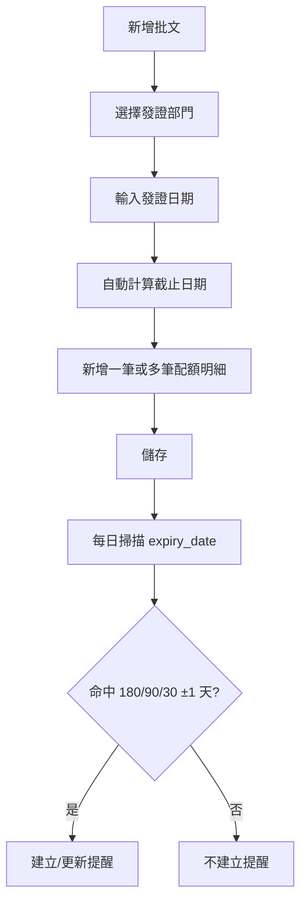

# 批文管理操作手冊（新流程）

## 1. 新增批文
1. 選擇僱主
2. 選擇/輸入合作方（可留空讓系統綁定預設）
3. 輸入批文編號
4. 選擇發證部門（固定下拉）
5. 輸入發證日期（不得大於今日）
6. 系統自動帶出截止日期（唯讀）
7. 在配額明細區塊逐筆新增職位資料
8. 儲存

## 2. 配額明細操作
- 點「新增配額」新增空白列
- 每列可刪除（需確認）
- 可連續新增多筆後一次儲存

## 3. 提醒處理
- 業務概覽會顯示 180/90/30 天到期提醒
- 支援「標記已讀」與「再次提醒」

## 4. 流程圖

